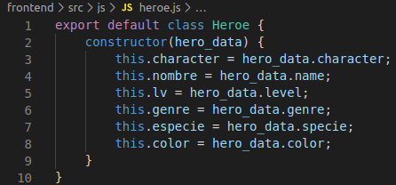

## dsi-p8-docker-alu0100658705

## Pablo Bethencourt Díaz

## alu0100658705@ull.edu.es

### Instalación de Docker

| Información del sistema: |                        |
| ------------------------ | ---------------------- |
| Sistema Operativo        | Ubuntu 18.04.4 LTS     |
| Kernel                   | Linux 5.3.0-51-generic |
| Arquitectura             | x86-64                 |

    a. Pasos previos:

        Desisntalar los siguientes paquetes en caso de estar previamente instalados:

        - docker
        - docker-engine
        - docker.io
        - containerd
        - runc

        Actualizar los repositorios del sistema.

    b. Instalación de dependencias para Docker:

        Instalar los siguientes paquetes:

        - apt-transport-https
        - ca-certificates
        - curl
        - gnupg2
        - software-properties-common

        Añadimos la "GPG key" oficial de Docker:
        "curl -fsSL https://download.docker.com/linux/ubuntu/gpg | sudo apt-key add -"

        Añadimos el repositorio: "sudo add-apt-repository \
        "deb [arch=amd64] https://download.docker.com/linux/ubuntu \ $(lsb_release -cs) \stable" "

    c. Instalación de paquetes de Docker:

       Instalamos los siguientes paquetes:

       - docker-ce
       - docker-ce-cli
       - containerd.io

       Damos permisos para ejecutar Docker al usuario actual: "sudo usermod -aG docker $USER"

Trás realizar todos los pasos anteriores, comprobamos que se ha instalado correctamente:

### Desarrollo de la práctica

#### 1) Configuración del backend: Aplicación Node

Iniciamos un proyecto Node.js con <code> _npm init_ </code> y realizamos la instalación de _express_ mediante <code> _npm install express_ </code>.

Definimos una aplicación en el fichero _server.js_, donde mediante el uso de _express_ se realiza direccionamiento a diferentes peticiones:

Las peticiones son las siguientes:

1. Petición <code> / </code>, que devuelve la versión de app:

2. Petición <code> /api </code>, devuelve un JSON con la información del fichero _data.json_:

#### 2) Dockerizar la aplicación Node:

1. Definimos el fichero _Dockerfile_:

Para optimizar la imagen utilizamos la versión slim de node y definimos un fichero _.dockerignore_:

2. Generamos la imagen con el comando <code> docker build -t pablo/app_node . </code>

3. Creamos el contenedor y realizamos las comprobaciones para verificar su correcto funcionamiento:

Ejecutamos el comando <code> docker run --rm --name backtest -p 8081:8081 -d pablo/app_node </code> con la opción -d para ejecutarlo en segundo plano.

Realizamos las siguientes comprobaciones:

- Utilizamos _docker ps_ para obtener comprobar que en que estado se encuentra la imagen:

- Ejecutamos curl y obtenemos la siguiente salida:

- Para agilizar el proceso, podemos añadir los anteriores comandos a un fichero _run.js_

Una vez realizadas todas las configuraciones, la estrcutura que deberíamos tener es la siguiente:

#### 3) Creación del frontend

Para la parte del frontend se lee la información desde el contenedor de Node y se crea una estructura de cartas en el DOM con los datos extraidos del fichero JSON:

1. Para empezar instalamos Parcel y generamos la estructura de directorios adecuada para este nuevo contenedor.

2. En el archivo _index.html_ definiremos dos elementos **
** que alojaran las peticiones realizadas desde el arvhico js.

3. En cuanto a los ficheros JS, se han definido dos; el primero, una clase _Heroe_ que contendrá la información para cada personaje definifo en el JSON:

El segundo, el fichero _index.js_, donde se realizan los fetch,y, mediante el uso de promesas, desde la API de Node se recupera la información para ser implementada en el _index.html_:

Mediante la información que se obtiene, se va iterando y, para cada uno de los elementos del JSON, se instancia la clase _Heroe_, creando un nuevo objeto que se añade a una array. Finalmente, para cada uno de los elementos del array se define un elemento _div_ con nombre de clase "carta", que contendrá la información del héroe en cuestión:

4. Se define un archivo _index.css_ similar al empleado en la práctica 4 de la asignatura.

5. Configuramos el fichero del servidor _Nginx_:

Estructura del directorio del frontend:

#### 4) Dockerizar la aplicación Node:

Una vez tenemos generados los ficheros necesarios y configurado el servidor _Nginx_, debemos definir el _Dockerfile_, así como el fichero _.dockerignore_ y el script _run.sh_.

Contenido del Dockerfile:

- En la primera fase tomamos una imagen de node (la misma que para el caso del backend), se copian los archivos del proyecto, se instalan las dependencias y se genera la carpeta _dist_ con el proyecto.

- En la segunda fase tomamos una imagen de _Nginx_, tomamos la configuración que hemos definido anteriormente, le pasamos el build del paso anterior y arrancamos el servidor con <code> CMD ["nginx", "-g", "daemon off;"] </code>

El contenido del _.dockerignore_ será igual que en el caso anterior, así como el del script _run.sh_.

Comprobamos su correcta ejecución:

#### 5) Docker Compose

Una vez creados los contenedores anteriores se deberá hacer uso de Docker Compose para unirlos.

En primer lugar instalamos la utilidad:

    Ejecutamos los siguientes comandos:

    1. sudo curl -L
    "https://github.com/docker/compose/releases/download/1.25.5/docker-compose-$(uname -s)-\$(uname -m)"
    -o /usr/local/bin/docker-compose

    2. sudo chmod +x /usr/local/bin/docker-compose

    Comprobamos que la instalación se he realizado correctamente:

A continuación, creamos un fichero _docker-compose.yml_, donde definimos dos servicios (uno para node y otro para nginx), definimos la ruta donde se encuentran los Dockerfiles de los contenedores, le asignamos un nombre a cada uno de ellos y los unimos mediante una red:

Una vex definido el fichero, realizamos la ejecución de los comandos <code> docker-compose build </code> y <code> docker-compose up </code> definimos en _run.sh_, veamos la correcta ejecución del comando:

Y el resultado final de la práctica:

